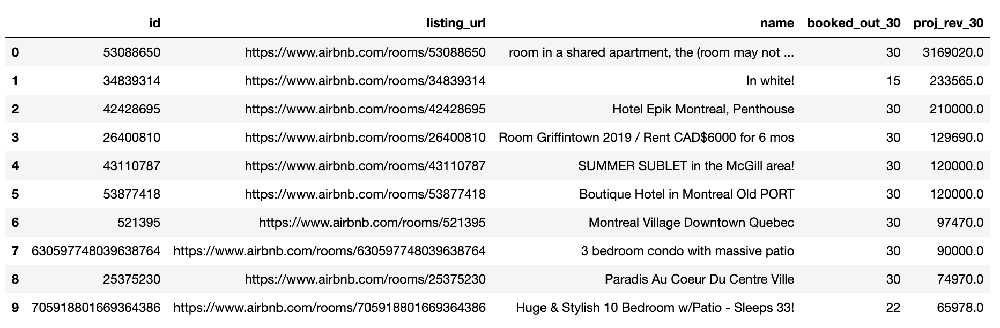
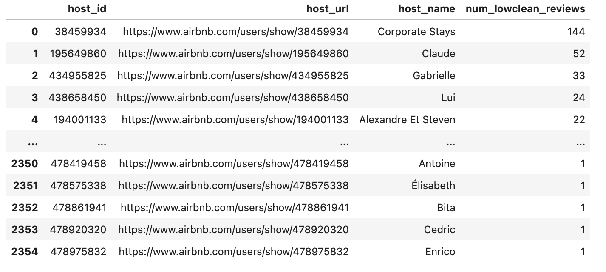
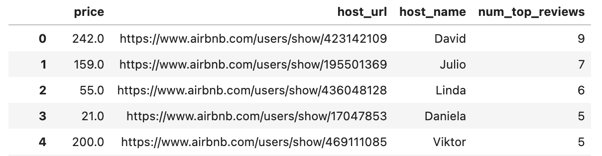

# 🏠 Montréal Profitable AirBnBs - SQL

## 🎖️ Goals
1. To know how much the top Airbnb Earners are making in Montréal.
2. To get a list of potential customers for an Airbnb cleaning business.
3. To know the most top rated listings.

## 🗄️ Data
The detailed listing data was collected through [Inside AirBnB](http://insideairbnb.com/get-the-data/) on September 12, 2022.
  The original dataset contained 13,621 rows and 75 columns but after cleaning the data, there are 13599 rows and 67 columns.

## 💰 Top 10 Airbnb Earners
List of all the top 10 highest earners based on the numbers of days the accommodation is already reserved for the month and the projected revenue.

## 🫧 Potential customers for an Airbnb cleaning business
These are list of Airbnb units that were rated low for cleanliness and might be potential customers for someone wanting to start up a cleaning business.

## 💯 Accommodations with top rated review scores
These are top 5 listings with review scores of 5.

